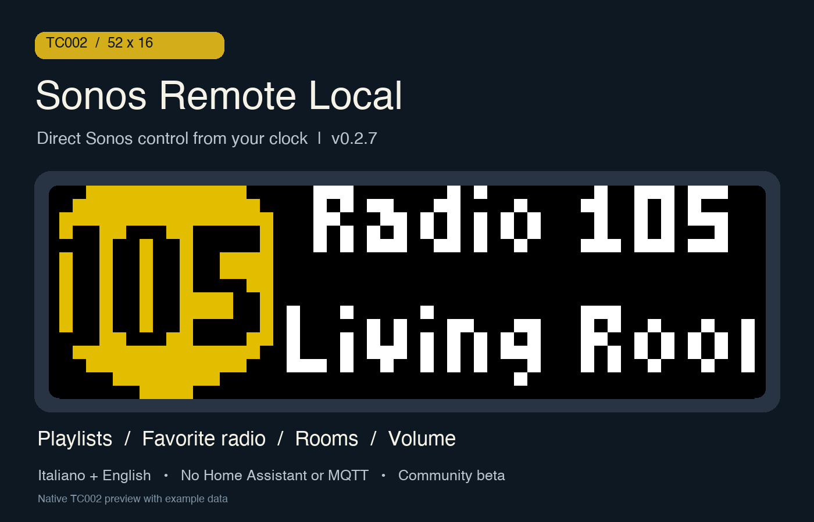
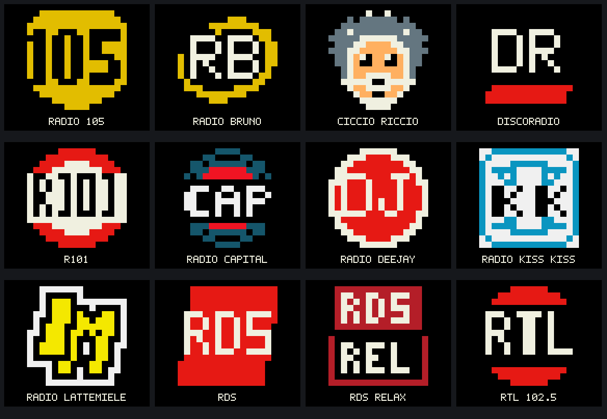

# Sonos Remote Local

**Version 0.2.9 · AWTRIX NG TC002 · 52×16 · Italiano / English**

Control Sonos from the TC002 knob and buttons, with a Berry app running directly on the clock. It talks to your Sonos speakers over the local network using HTTP/SOAP. No Home Assistant, MQTT broker, computer or bridge is required at runtime.

This is a separate project from [Sonos Remote for Home Assistant](https://github.com/lucaamo/tc002-sonos-remote). Both can remain installed. This community beta is intended for the **official TC002 firmware**, version 0.2.9 tested on **AWTRIX NG 1.2.2** (earlier revisions on 1.1.7). It is not a TC001 / 32×8 app.





## Features

- Select a Sonos room by its friendly name. Playback commands follow its group coordinator; volume controls the selected room.
- Browse radio favorites and playlists, including service playlists saved as Sonos favorites and saved Sonos playlists. The app combines the `FV:2` and `SQ:` catalogs and removes duplicate URIs.
- Turn the knob during music playback for previous / next track, when the source supports it. During radio playback, turn it for the previous / next favorite station.
- Show station names and available song metadata for radio, with room, volume and state as the fallback; artist, title and available artwork for music. Long names scroll instead of being shortened to codes.
- Twelve custom radio symbols drawn as native 16×16 pixels, with an option to use the original station artwork instead.
- Choose **Italiano** or **English** in the app settings. An on-screen controls guide is available from the middle button.
- Choose **Menu** or **Now Playing** as the startup screen. Opening Now Playing reads the selected room's current playback without starting or resuming music.
- Stay open as an on-demand app until you exit it. It does not return to the carousel after an idle timeout.

## Install

[Install from AWTRIX Hub](https://awtrix.de/flow/mH4KFyXKLosV) · [Download release 0.2.9](https://github.com/lucaamo/tc002-sonos-local/releases/tag/v0.2.9)

The Hub app declares both helper dependencies. Include them when installing. Individual pages: [Protocol](https://awtrix.de/flow/zg8uGt07AUbk) and [UI](https://awtrix.de/flow/wskMqqQkNc33).

Install the two helper modules **first**, then the app, through the AWTRIX NG Scripts / Berry editor in the TC002 Web UI. Use these exact script names:

| File | Script name | Purpose |
| --- | --- | --- |
| [sonos_local_protocol.ax](modules/sonos_local_protocol.ax) | `sonos_local_protocol` | Sonos LAN protocol helper, version 0.2.4 |
| [sonos_local_ui.ax](modules/sonos_local_ui.ax) | `sonos_local_ui` | Menus, controls and display, version 0.2.9 |
| [sonos_local_probe.ax](apps/sonos_local_probe.ax) | `sonos_local_probe` | Sonos Remote Local, version 0.2.9 |

The app retains the internal name `sonos_local_probe` for compatibility with existing local installations. Its visible name is **Sonos Remote Local**.

Open the app settings, enter the IP address of **one Sonos speaker** under **IP Sonos iniziale / Seed IP**, save, and launch the app from the clock menu or Web UI. The app reads the Sonos topology to discover rooms and group coordinators. The clock must be able to reach the speakers on the LAN, including TCP port 1400. A DHCP reservation for the seed speaker is useful.

Select **Lingua / Language → Italiano or English** and restart the app to apply the language. Italian is the default. The firmware menus and Sonos-provided names keep their own language.

Choose **Schermata iniziale / Startup screen → Menu or Now Playing**. Menu is the default, preserving existing behavior. Save and reopen the app to apply the change. Now Playing displays the remembered room's playback, artwork and radio metadata when available; paused or stopped playback stays that way. Hold the knob to open the main menu, including Playlists, Radio and Player.

See [detailed setup and troubleshooting](docs/INSTALLATION.md) and the [guida rapida in italiano](docs/QUICKSTART.it.md).

## Controls

| Control | In menus | While playing |
| --- | --- | --- |
| Turn knob left / right | Previous / next item | Music: previous / next track. Radio: previous / next favorite station |
| Short knob click | Confirm selection | Play / pause |
| Hold knob | Go back | Open the main menu |
| Top left / right buttons | Selected room volume − / + | Selected room volume − / +; hold to repeat |
| Short middle button press | Show / close the controls guide | Show / close the controls guide |
| Hold middle button | Exit to the AWTRIX carousel | Exit to the AWTRIX carousel |

The main menu contains **Playlists, Radio, Player, Now playing, Refresh favorites, Controls**. In Player, turn to the desired room and click to select it. In Playlists or Radio, turn to an entry and click to start it.

Radio changes are sequential. If Sonos is busy, the newest requested station is retained and shown while the current request finishes. A timeout reports an error; playback commands are not automatically retried.

## Radio song information

While a station is playing, its name and logo remain visible and the second line shows the song and artist when Sonos supplies readable metadata. The app understands plain ICY text, DIDL title/creator fields and the structured radio formats observed during development. Technical stream filenames, URLs, placeholders, years and packet identifiers stay hidden.

Without usable song metadata, or while paused, stopped or starting, the second line shows the selected room, volume and playback state. Command feedback keeps priority. Metadata availability depends on the station and the Sonos source.

To update from 0.2.8, replace the **UI helper and main app** with 0.2.9. The protocol helper remains 0.2.4. Keep the existing script names to preserve settings; the new startup setting defaults to Menu.

## Artwork

The native symbols cover Radio 105, Radio Bruno, Ciccio Riccio, Discoradio, R101, Radio Capital, Radio Deejay, Radio Kiss Kiss, Radio Lattemiele, RDS, RDS Relax and RTL 102.5. Matching uses public station IDs or station names. They are compact, unofficial visual adaptations for the LED matrix, not artwork downloaded from a service.

Disable **Loghi radio personali / Custom radio logos** to prefer original radio artwork. Other stations use available artwork or a visible radio fallback. Artwork availability and decoding depend on the source and firmware; native symbols render without downloading an image.

## Practical limits

- Sonos music services still need their own account, availability and internet connection. Audio plays on Sonos, not on the clock.
- The playlist browser is a Sonos favorites / saved-playlist browser, not a full Spotify or other service library. Track navigation depends on the source and Sonos transport capabilities.
- Starting a playlist **appends it to the existing Sonos queue**, seeks to its first added track and starts playback. It does not clear the queue.
- Existing groups are read and respected. Creating groups, stereo pairs, Sub or surround arrangements is not implemented.
- One seed IP is configured manually; there is no SSDP discovery or event subscription. Status is refreshed by bounded polling.
- Catalog requests fetch five entries per page by default; the default combined limit is 128, adjustable up to 256. Large or unusual metadata may exceed the 32 KiB response bound.
- This uses unofficial Sonos UPnP interoperability. Compatibility with every speaker, firmware and provider is not guaranteed.

The real playlist start was confirmed during development. Protocol and UI behavior are covered by isolated Berry checks; all twelve custom symbols were checked on the TC002 framebuffer, including the three revised symbols in 0.2.7. Real audio controls across every service and group configuration have not all been verified. See [testing](docs/TESTING.md).

## Development

The runtime consists of three Berry files; Python is only used to rebuild repository assets:

```sh
python3 tools/build_radio_logos.py --check-ui
```

This rebuilds the PNG/SVG gallery and verifies that its pixel data matches the UI module. The three original approved symbols remain byte-identical.

See [architecture](docs/ARCHITECTURE.md) and [changelog](CHANGELOG.md). Report problems in [GitHub Issues](https://github.com/lucaamo/tc002-sonos-local/issues), with firmware version and a description of the source/control involved. Remove private addresses and account identifiers from any logs you share.

## License and credits

Source available under [PolyForm Noncommercial 1.0.0](LICENSE.md). See [notices](NOTICE.md). Sonos Remote Local is an unofficial community project and is not endorsed by Sonos, Ulanzi or AWTRIX.

Required Notice: Copyright © Stephan Mühl (Blueforcer) https://github.com/Blueforcer/awtrix-ng
